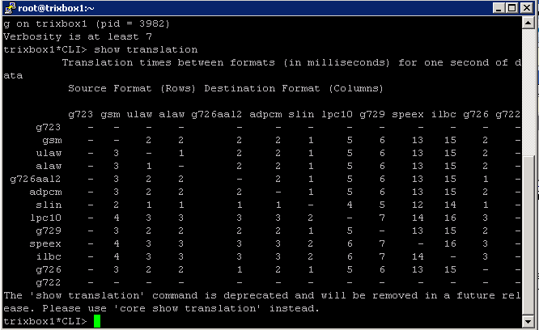
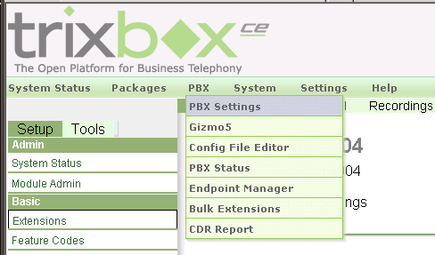
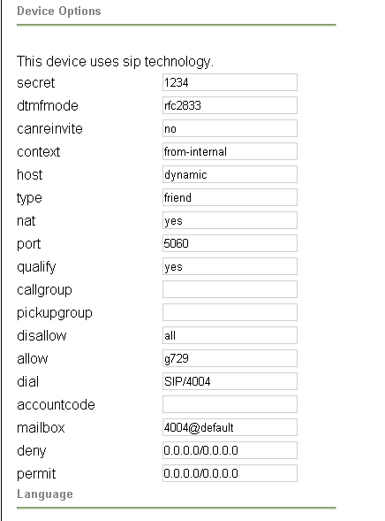

The G.729 codec is a low-bandwidth codec, excellent for use in VoIP.

In this case, a client which my company manages wanted to minimize bandwidth usage from VoIP phones traveling through a VPN. Both the G729 & G723 codec are freely available from [here](http://asterisk.hosting.lv/), though you can alawys purchase a copy from [Digium](store.digium.com/productview.php?product_code=G729CODEC).

First download the G729 codec appropriate for your processor & system type. A great way to find this information is to run a `cat /proc/cpuinfo` and a `uname -m` command. Search down through the list (ensure you download G729, not G723!) for your appropriate binary. In my case, we were running on a P4 with no ss3, so I stuck with the standard `codec_g729ast14-gcc4-glibc-pentium4.so` binary.

Now, I'm not sure if this is necessary, but I moved the `/usr/lib/asterisk/modules/format_g729.so` file out of the `/usr/lib/asterisk/modules` folder, over to `/home/root`. I did this to ensure we were starting fresh.

Next, copy the downloaded codec over to that same `/usr/asterisk/modules` folder. Connect into asterisk console with the command `asterisk -r`, and load the new codec with `module load codec_g729-ast14-gcc4-glibc-pentium4.so`, or whatever your codec was.

You would think the phone system would be ready for G729 use, but in my case, I needed to restart asterisk with the command `restart gracefully`. Ensure everyone is out of the office, as this will drop all live calls!

When asterisk comes back up, log back into asterisk and run the command show translation which should give you some output such as the following:

As long as there’s a `#` (in this case, 6’s) and not a `–` under the g729 codec, we know it’s working properly.

The next step would be to head into the web interface, under `PBX->PBX Settings->Extensions, choose` the extension you wish to enable the codec for, ensure disallow is set to `all` and allow is set to `g729`.

Once the extension is set up to allow g729, you can test whether it’s working properly by having a test call connected and running the command sip show channels:

> trixbox1\*CLI> sip show channels
> Peer User/ANR Call ID Seq (Tx/Rx) Format Hold Last Message
> 10.100.253.91 4004 2e1225e1-27 00101/00002 0x100 (g729) No Rx: ACK

:).
