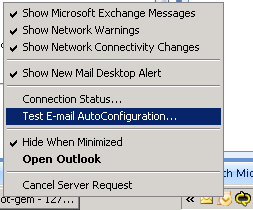
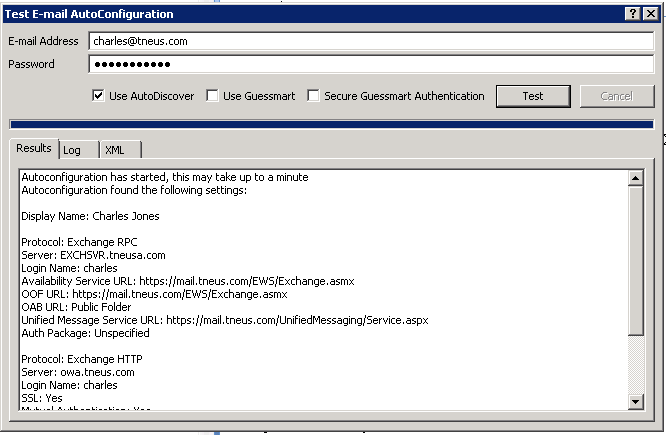
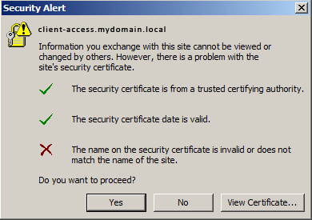

If you're getting frustrated by Outlook 2007 clients receiving error 0x80070422 when trying to Send/Receive the Offline Address Book, the first thing to check is your Exchange 2007 service URL's.

The quickest way to test this from the client end would be to hold CTRL & right click your Outlook 2007 Icon. Choose the option "Test E-mail Autoconfiguration..."

This will open up a new window (see below). In this window, uncheck the options "Use Guessmart" & "Secure Guessmart Authentication." Enter your password & hit "Test."

If your AutoConfiguration test completes successfully, then you're probably wondering why you're still receiving error 0x80070422. If your email AutoConfiguration test does not complete successfully, please verify your Exchange 2007 Web Service URL's as per this article.

Once you resolve any issues with email AutoConfiguration, many Outlook 2007 issues will also follow! A good example would be when you know that your server certificate is valid, yet you're still receiving a security warning similar to:

Check those service URL's!

Now, the next step to remediating your 0x80070422 error (which is a CLIENT SIDE ERROR), enable the BITS service on the client PC.
