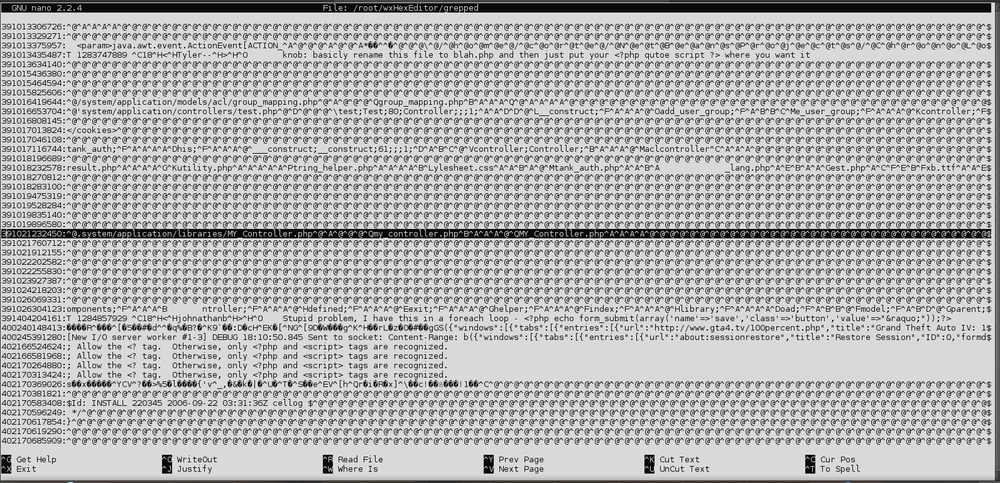
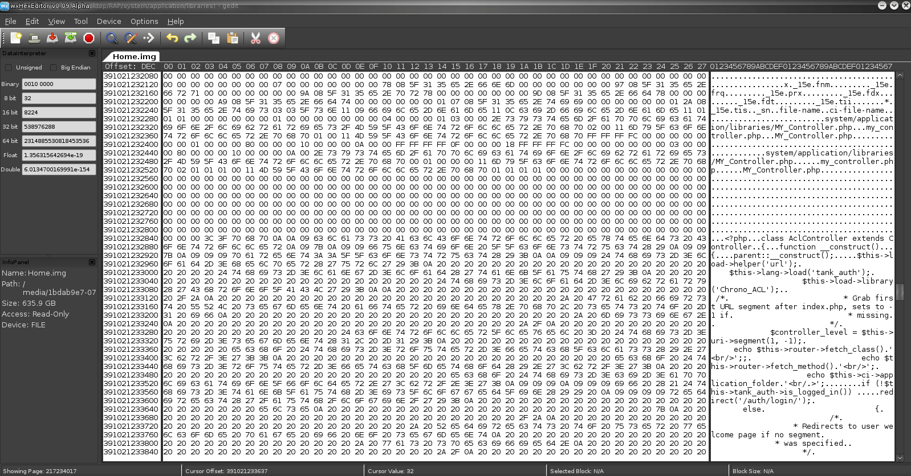

As a network tech, I should always follow the golden rule of backup up data. I recently attempted resizing a partition (after neglecting this pinnacle of IT) & completed destroyed a PHP web application I had been working on.

The PHP web application was stored in a VM on the host's ext4 partition, and I had managed to destroy both the superblock & journal of the host's filesystem. After an unsuccessful attempt to restore the superblock from a backup on the drive, I figured the FS to be toast, but couldn't accept that the data had been completely lost.

What I really should've done was taken a DD image from the get-go with the following command:

```
# dd if=/dev/sda4 of=/media/Storage/Drive_Backup.img
```

After a bit of research and IRC chat, I was directed toward the following page: http://wiki.yak.net/592. The script seemed perfect for what I had needed to do. I knew the destroyed partition had only been 0.1% non-contiguous, so my hope was to completely recover the virtual hard disk image, or at least a repairable copy.

To begin, I created a test, dynamically expanding VDI file & opened it within a hex editor:


I could now see that each VDI file began with the string `<<< Sun Virtualbox Disk Image >>>`--the idea was to copy a large amount of data past where the script managed to locate things string, and to chop off the residual data with a hex editor.

I proceeded to test the procedure by placing the small test VDI file on an ext4 drive, searching for the data by reading the drive byte by byte, and copying only a small amount of data (~1mb) past the point where the magic string was found. The test was successful, though I still doubted I'd be able to recover a usable VDI file.

After a bit of modification to the script posted above (http://wiki.yak.net/592), I was able to successfully pick up around 10 VDI files off my dead drive (arbitrarily sized to 4GB past the magic string). After a bit of searching through these recovered VDI files, I found the exact file I was looking for. Unfortunately, my suspicions were confirmed when GRUB was found, but damaged beyond repair.

At this point, after a bit more research (http://www.linux.com/community/blogs/howto-read-a-virtualbox-vm-disk-wout-starting-the-vm.html), I began to realize that all a VDI file did was encapsulate the virtualized file system within VirtualBox metadata.

From here, I scrapped the whole idea of recovering the VDI and went directly for the plain text data off the drive itself.

To search through the drive, I ran the command:

```
$ grep -ab "php" /dev/sda4 > grepped
```

As I knew I was searching for plain text files that began with "php"--the search worked flawlessly. The "-b" option on grep, also records the decimal memory address where each instance of the string was found.

When the search completed, I had a list of the location of every instance of the "php" tag on the drive. This was a massive amount of data to sift through, but I managed to find the location (or at least get close to the location) of the important data I needed, by refining the search with the code's filename; for example:



Basically, we can see that a reference to the filename `MY_Controller.php` & a memory address of `391021232450` (decimal). After heading over to the offset through wxHexEditor, I can see quite clearly that my PHP code is in fact intact:



And it's complete with formatting & indentation :). From here, I've simply copied & pasted out each file as I found them, though some were not quite as straightforward.

It'll take a lot of hard work & determination to get your files back, so you need to decide whether it's worth it.

Also try out [PhotoRec](https://www.cgsecurity.org/wiki/PhotoRec) & [foremost](http://foremost.sourceforge.net/) if you need to recover stuff that isn't plain text.

CJ
