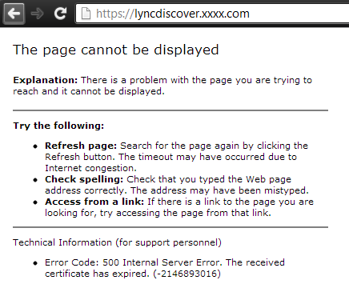
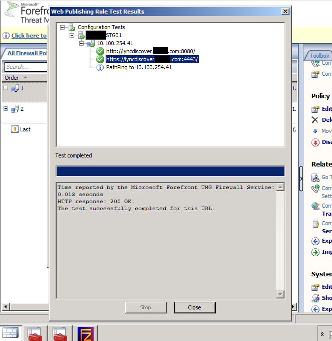

Our CA certificate recently expired and we were experiencing a smorgasbord of issues after renewing the CA cert itself. One issue we were running into is that our Lync mobile clients stopped connecting, and our external clients were receiving the following error:

> Cannot synchronize with the corporate address book. This may be because the proxy server setting in your web browser does not allow access to the address book. If the problem persists, contact your system administrator.

Knowing that this was most likely related to the certificate, I checked and found my certs were up to date and working properly on both the Front End and Edge servers. The next thing I checked was attempting to use the Microsoft Lync Connectivity Analyzer. This threw an error stating:

> Server discovery failed for unsecured external channel against https://lyncdiscover.xxxxx.com/

So I attempted accessing the URL directly from a web browser and came up with the following:

Hmm, so the certificate has expired? That's strange as I had previously checked both the FE & Edge servers. Next, I checked the TMG server and performed a rule test like so:

In the screenshot the test has passed (I took this after implementing the fix), but originally the https://lyncdiscover.xxxxx.com:4443 had failed the test with the same error reported by the web browser. At this point I realized that the certificate could not be validated as I had not installed the new internal CA trusted root certificate within the TMG server. After installing the root CA certificate all issues were now resolved.
