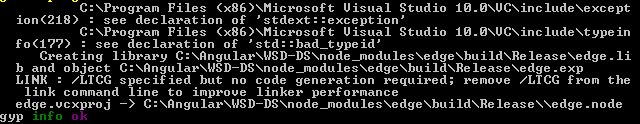
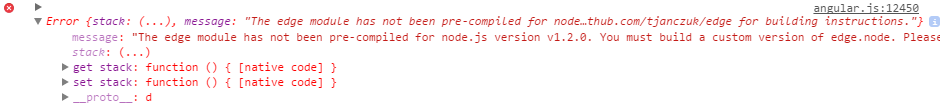

This is something I needed to get functioning for work. Luckily it wasn't so difficult--the hardest part was attempting to figure out why after I compiled Edge.js properly for NW.js v0.12.3 why it wouldn't actually attempt to load the native `edge.node` module.

First things first, we need to make sure the following is installed on your machine:

[Windows 7 SDK 7.1](http://www.microsoft.com/en-us/download/details.aspx?id=8279)

Since I already do quite a bit of development on my machine I was lucky to already have VS 2013 & the Windows 7 SDK 7.1 installed.

Next, go ahead and open up the "Windows SDK 7.1 Command Prompt" from the start menu.

For the next steps, Vijay Kumar has provided some excellent steps [here](https://github.com/tjanczuk/edge/issues/105):

    Brief procedure for some one who might be interested.
    My code was in the directory C:\tdameri\xlsxcplus\test1
    I used the Windows 7 SDK 7.1 command prompt (you need to have Windows 7.1 SDK installed)
    Commands in the command prompt
    setenv /x86
    cd C:\tdameri\xlsxcplus\test1
    npm install edge
    cd C:\tdameri\xlsxcplus\test1\node_modules\edge
    nw-gyp configure --target=v0.8.4
    nw-gyp build
    The build happened without errors.
    Copy the edge.node file from edge\build\release folder
    and replace the edge.node files the edge\lib folder.

Unfortunately it wasn't so simple as it appeared my corporate proxy was blocking or throwing 403 errors when nw-gyp was attempting to pull the NW.js headers from the Amazon AWS site. After looking through a bit of the code, I discovered `install.js` did in fact contain proxy support:

```js
// basic support for a proxy server
var proxyUrl = gyp.opts.proxy || process.env.http_proxy || process.env.HTTP_PROXY || process.env.npm_config_proxy;
```

Woohoo! I was able able to simply set my `HTTP_PROXY` environment variable and move forward. A quick note is that Vijay was building for x86 while I was building for x64, therefore, the only change I needed from his steps was modifying the first line to:

```
setenv /x64
```

At this point, my custom `edge.node` was building properly:



Following Vijay's steps above, I found that even though we have build `edge.node`, we now need to copy it from:

```
node_modules/edge/build/Release/edge.node
```

Over to:

```
node_modules/edge/lib/native/win32/x64/
```

Speaking of my old friend Vijay--it looked like he didn't realize which folder to copy the newly compiled binary to. In my case, I figured if I was running NW.js v0.12.3--why not copy it over to the `0.12.0` directory?

Thinking I was in the clear I attempted firing up NW.js and discovered to my horror:



Boo! As it turns out, the error does in fact state Edge appears to be looking for a `v1.2.0` folder. Digging into the Edge.js code more, I discovered the following under `node_modules/edge/lib/edge.js`:

```js
var versionMap = [
  [/^0\.8\./, '0.8.22'],
  [/^0\.10\./, '0.10.0'],
  [/^0\.12\./, '0.12.0'],
  [/^4\./, '4.1.1'],
];
```

Aha! So since Edge is looking to match v1.2.0, I went ahead and modified the above to so:

```js
var versionMap = [
  [/^0\.8\./, '0.8.22'],
  [/^0\.10\./, '0.10.0'],
  [/^0\.12\./, '0.12.0'],
  [/^4\./, '4.1.1'],
  [/^1\.2\./, '1.2.0'],
];
```

Then proceeded to create the following directory:

```
node_modules/edge/lib/native/win32/x64/1.2.0
```

And finally dump all the files from the "0.12.0" files into this folder. After copying the files over, boomzy:


Hope this saves someone a headache.

-CJ
