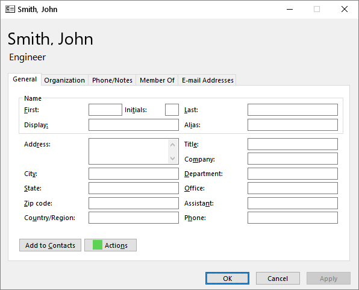
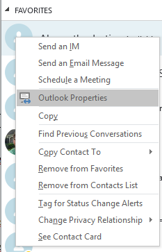

Since the advent of Office 2013, I've been increasingly frustrated with the new Outlook contact cards, and the round-about way needed to access the legacy GAL properties dialog as shown below:

:::note
This solution was originally developed for Skype for Business 2013/2015. While it worked reliably for several years, Microsoft has since moved to Teams as their primary collaboration platform.
:::



After a ton of research, I discovered it's possible to add custom context menus within the Lync 2013 / Skype for Business client, as per [this page from Microsoft](https://msdn.microsoft.com/en-us/library/office/jj945535.aspx). From here, I needed to discover the API necessary to actually launch the legacy GAL properties dialog box. Doing a bit of research, I simply could not find an easy way to do this, the only thing I was coming across was the following registry key, which just launched the GAL properties box from within Outlook:

```reg
Windows Registry Editor Version 5.00

[HKEY_CURRENT_USER\Software\Microsoft\Office\16.0\common\contactcard]
"TurnOnLegacyGALDialog"=dword:00000001
```

Nearly giving up after hours of digging through the API and searching, I was provided some help via [Dmitry Streblechenko](https://stackoverflow.com/users/332059/dmitry-streblechenko) on [StackOverflow](https://stackoverflow.com/questions/47146387/is-there-any-way-to-launch-the-global-address-list-gal-properties-dialog-progr) (thank you, Dmitry!).

In the end, I ended up with a simple VBS and registry key:

**LaunchGALProperties.vbs**

```vb
If WScript.Arguments.Count = 2 Then
  Dim objOutlook : Set objOutlook = CreateObject("Outlook.Application")
  Dim objNamespace : Set objNamespace = objOutlook.GetNamespace("MAPI")

  objNamespace.CreateRecipient(WScript.Arguments(1)).AddressEntry.Details()

  Set objOutlook = Nothing
  Set objNamespace = Nothing
End If
```

**LaunchGALProperties.reg**

```reg
Windows Registry Editor Version 5.00

[HKEY_LOCAL_MACHINE\SOFTWARE\WOW6432Node\Microsoft\Office\16.0\Lync\SessionManager\Apps\{4C13AA00-01F0-428C-B582-38E4F726D97E}]
"Name"="Outlook Properties"
"ApplicationType"=dword:00000000
"SessionType"=dword:00000000
"ExtensibleMenu"="ConversationWindowRightClick;MainWindowRightClick;MainWindowActions;ConversationWindowActions;ContactCardMenu"
"ApplicationInstallPath"="C:\\\\windows\\\\System32\\\\wscript.exe"
"Path"="C:\\\\windows\\\\System32\\\\wscript.exe C:\\\\temp\\\\LaunchGALProp\\\\LaunchGALProperties.vbs \"%user-id%\" \"%contact-id%\""

```

Boom! After restarting Skype for Business, I was treated with the following view:



It's quite unfortunate that Microsoft removed this functionality within the newer versions of the Lync/Skype clients, but at least with a little bit of elbow grease I was able to recover it...for now.

### Update — April 2019

It appears that the `wscript` command is no longer working (for some reason). I was able to workaround this by creating a C# project with the following source code:

**Program.cs**

```csharp
using System;

namespace LaunchGALProps {
 class Program
 {
  static void Main(string[] args) {
   if(args.Length == 2)
   {
    dynamic objApp;
    dynamic objNamespace;

    objApp = Activator.CreateInstance(Type.GetTypeFromProgID("Outlook.Application"));
    objNamespace = objApp.GetNamespace("MAPI");

    objNamespace.CreateRecipient(args[1]).AddressEntry.Details();
   }
  }
 }
}
```

If you do not have Visual Studio installed, but you DO have .NET v4+ installed, you can compile the application like so:

```batch
C:\Windows\Microsoft.Net\v4.0.30319\csc.exe /out:LaunchGALProps.exe Program.cs
```

After my program was compiled, I was able to update my registry key values for `ApplicationInstallPath` and `Path` -- once this was done everything was working again.

:::tip
If you're still using Skype for Business, you can compile the C# version using the .NET Framework that's already installed on Windows. No Visual Studio required!
:::

:::danger
Modifying registry keys can cause system instability if done incorrectly. Always back up your registry before making changes and test in a non-production environment first.
:::
