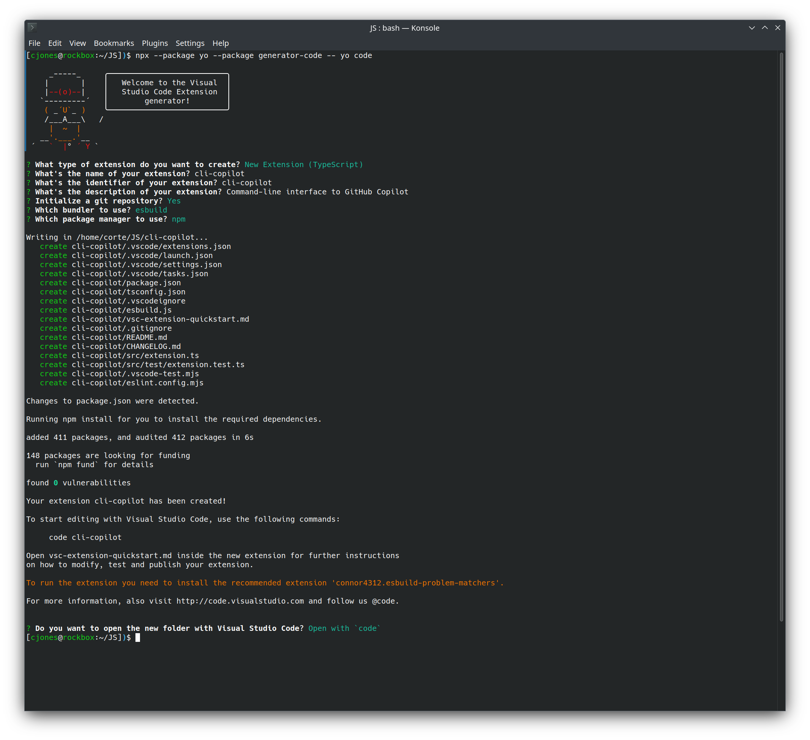
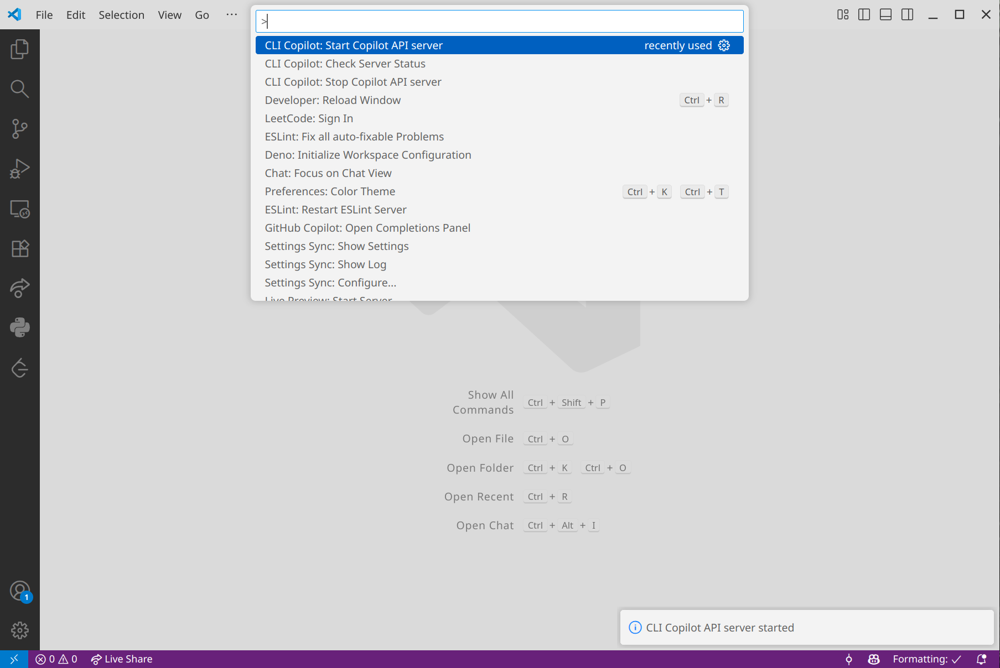

I used to operate from the belief that true engineering mastery involved the manual, highly focused grind: meticulously hunting for obscure APIs, writing repetitive boilerplate, and holding entire libraries in my working memory. I was completely invested in the idea that my personal, low-level effort was the only way to guarantee a reliable solution.

The introduction of Copilot has completely obliterated the old SWE workflow--the manual, highly focused grind: meticulously hunting for obscure APIs, writing repetitive boilerplate, and holding entire libraries in working memory.  Software engineering has been transformed into a discipline of architectural intent rather than pure implementation labor.

Being Copilot is an incredibly valuable tool for anyone keeping abreast of the current landscape, finding ways creative to utilize the technology can be a huge boon to productivity.
  
One of the biggest limitations I've run into with Copilot is that, without [Copilot CLI](https://github.com/features/copilot/plans) (which was still lacking a significant amount of capabilities last time I looked at it), we have no way of programmatically interacting with Copilot outside of the IDE.

In this blog series, we will dive into an ingenious workaround for this common challenge: leveraging a custom-developed VS Code extension to enable direct Command Line Interface (CLI) communication with Copilot Chat.

## 🛠️ Part 1: Scaffolding our project

The core of our strategy relies on an internal server hosted within the VS Code environment. We will utilize an [Express](https://expressjs.com/) server for this purpose (while acknowledging that modern frameworks like [Fastify](https://fastify.dev/) offer performance gains, Express is more than sufficient and familiar for this proof-of-concept). This server will act as the intermediary, accepting a prompt from the CLI, passing it to the VS Code extension/Copilot, and streaming the resulting response back to the user.

To ensure this bridge is functional and secure across all user sessions, we must keep several key technical requirements in mind:

### Essential Requirements

-   <a id="security-isolation"></a>**Security & Isolation:** We must strictly ensure that our internal server only accepts connections originating from `localhost` (127.0.0.1). This prevents external access and unauthorized API usage.
-   <a id="port-management-hosting"></a>**Port Management & Multi-Instance Handling:** Since a new server instance will launch with _every_ VS Code window, we need a reliable mechanism to dynamically find and bind to an available port. We must also persist the currently used port so the external CLI can correctly address the active VS Code window.    
-   **Settings Persistence:** We require robust management of extension settings. This includes providing sensible defaults for all critical parameters (like the default communication port) and allowing users to easily set and persist custom configurations.    
-   **Response Streaming:** To provide a responsive, native chat experience, the server must be capable of streaming the Copilot response back to the CLI client in real-time, rather than waiting for the entire response to complete.    
-   **Error Handling:** The system must implement graceful failure mechanisms for common issues, such as port contention, server startup failure, or communication errors with the Copilot Chat API itself.
-   **Extension Activation Control:** The server should only start once the extension is fully activated and the necessary VSCode APIs are available. Similarly, the server must be reliably shut down (disposed of) when the VSCode window is closed or the extension is deactivated.

### Creating our Visual Studio Code  extension

We begin by scaffolding our our extension as per the [official documentation](https://code.visualstudio.com/api/get-started/your-first-extension):

`npx --package yo --package generator-code -- yo code`

We'll be prompted for what type of extension to create, in this case, I'll be creating a `New Extension (TypeScript)`.

Feel free to name your extension whatever you'd like, I'll stick with `cli-copliot`, and provide a simple description of the functionality:

>Command-line interface to GitHub Copilot

Let's go ahead and also initalize our Git repository, utilizing `esbuild` and `npm`.



Now that we have our extension scaffolded, we can start by installing some dependencies:

`npm i cors express && npm i @types/cors @types/express -D`

Now we'll need to define some commands in our `package.json` file -- we'll need a command to start the server, stop the server, and retrieve the server status.  This is defined under the `contributes.commands` [section](https://code.visualstudio.com/api/references/contribution-points#contributes.commands), as shown below:

```json
"contributes": {
  "commands": [
    {
      "command": "cli-copilot.startServer",
      "title": "CLI Copilot: Start Copilot API server"
    },
    {
      "command": "cli-copilot.stopServer",
      "title": "CLI Copilot: Stop Copilot API server"
    },
    {
      "command": "cli-copilot.serverStatus",
      "title": "CLI Copilot: Check Server Status"
    }
  ]
}
```

We'll also need to set up some configuration properties for our default port and whether the server autostarts.  We can configure these under `contributes.configuration` [section](https://code.visualstudio.com/api/references/contribution-points#contributes.configuration):

```json
"configuration": {
  "title": "CLI Copilot",
  "properties": {
    "cli-copilot.port": {
      "type": "number",
      "default": 3737,
      "description": "Port for the CLI Copilot API server"
    },
    "cli-copilot.autoStart": {
      "type": "boolean",
      "default": true,
      "description": "Automatically start the API server when VSCode starts"
    }
  }
}
```

With VSCode extensions, you will notice that we have some boilerplate code for the `activate` function in the scaffolded `src/extension.ts` file.  This function is called when your extension is activated--extensions are activated the very first time a command is executed, OR when utilizing a [Activation Events](https://code.visualstudio.com/api/references/activation-events).

In this case, we want our extension to start the server directly after VS Code startup is complete.  In order to do this, we can add the following section into our `package.json`:

```json
"activationEvents": [
	"onStartupFinished"
],
```

Finally, let's configure our `.vscode/launch.json` file to easily allow us to debug the extension with VS Code.  There's likely a better way to do this by modifying `tasks.json`, but let's keep it simple and update our build command:

```diff
 {
   "version": "0.2.0",
   "configurations": [
     {
       "name": "Run Extension",
       "type": "extensionHost",
       "request": "launch",
       "args": ["--extensionDevelopmentPath=${workspaceFolder}"],
       "outFiles": ["${workspaceFolder}/dist/**/*.js"],
-      "preLaunchTask": "${defaultBuildTask}"
+      "preLaunchTask": "npm: watch:esbuild"
     }
   ]
 }
```

### Implementing our extension commands

Going back to our `src/extension.ts`, we can begin by registering our commands, and create function stubs in order to validate they are being executed properly:

```typescript
async function startServer(): Promise<void> {
  return new Promise((resolve) => {
    vscode.window.showInformationMessage('CLI Copilot API server started');
    resolve();
  });
}

async function stopServer(): Promise<void> {
  return new Promise((resolve) => {
    vscode.window.showInformationMessage('CLI Copilot API server stopped');
    resolve();
  });
}

async function showServerStatus(): Promise<void> {
  return new Promise((resolve) => {
    vscode.window.showInformationMessage('CLI Copilot API server running');
    resolve();
  });
}

export function activate(context: vscode.ExtensionContext) {
  context.subscriptions.push(
    vscode.commands.registerCommand('cli-copilot.startServer', () => {
      return startServer();
    })
  );

  context.subscriptions.push(
    vscode.commands.registerCommand('cli-copilot.stopServer', () => {
      return stopServer();
    })
  );

  context.subscriptions.push(
    vscode.commands.registerCommand('cli-copilot.showServerStatus', () => {
      return showServerStatus();
    })
  );
}
```

Now we can run debug our project by hitting F5 (or Run->Start debugging) and open the command palette in the launched VS Code window.  Choose any of the options and you'll be able to see the information window toast:



Being we want to autostart our server (at least by default) when the extension is activated, after the VS Code window `onStartupFinished` event is fired, we need to read the configuration option and execute the `startServer()` function.  We can do this by adding some code under the subscription registrations:

```typescript
// Auto-start server if configured
const config = vscode.workspace.getConfiguration('cli-copilot');
const autoStart = config.get<boolean>('autoStart', true);

if (autoStart) {
  startServer().catch((error) => {
    vscode.window.showErrorMessage(`Failed to auto-start CLI Copilot server: ${error.message}`);
  })
}
```

:::note
We can also export an async `activation` function, but in this case we'll just use standard promise syntax.
:::

If we restart our debugging session, we can now see the `CLI Copilot API server started` message displayed immediately, instead of having to run a command!

### Planning our Express server strategy

Moving on, we now need a way to actually get our Express server running.  Keep in mind our requirements listed above, specifically the [Security & Isolation](#security-isolation) and [Port Management & Multi-Instance Handling](#port-management-hosting) requirements.

Our VS Code extension should implement a multi-layered security approach to ensure the Express server remains accessible only to local processes, while preventing conflicts from multiple instances. We also include CORS headers to restrict browser-based requests (which we won't be utilizing at this point in time) to local origins.

In order to prevent multiple server instances from conflicting, we will implement a lock file system which will track active servers by workspace and process ID.

Our lock file should look like below:

```json
{
  "port": 3737,
  "workspace": "/path/to/project",
  "pid": 12345,
  "timestamp": 1731283200000
}
```

The lock file system should also have the following key features:

1. **Workspace-based locking:** Each workspace gets a unique lock file identified by an MD5 hash of the workspace path, allowing multiple VS Code windows to run server simultaneously for different projects.
2. **Process validation:** Before starting a new server, the system checks if the process ID stored in the lock file is still running using `process.kill(pid, 0)`, which sends a signal 0 (no-op) to test process existence.
3. **Stale lock cleanup:** On startup, the system scans all lock files and removes those pointing to non-existent processes, preventing orphaned locks from blocking legitimate server starts.
4. **Automatic cleanup:** Lock files are removed when the extension deactivates or when servers shut down gracefully.

### Implementing our Express server

In order to implement our server, we first need to define a few imports and module-level variables:

```typescript
import express, { Request, Response } from 'express';
import corts from 'cors';
import * as http from 'http';
import * as path from 'path';
import * as fs from 'fs';
import * as os from 'os';
import * as crypto from 'crypto';

let server: http.Server | null = null;
let serverPort: number | null = null;
let lockFilePath: string | null = null;
```

Now in our `startServer` function, we can implement our actual logic.  Let's begin with our workspace-based locking:

```typescript showLineNumbers
async function startServer(): Promise<void> {
  return new Promise((resolve) => {
    if (server) {
      vscode.window.showWarningMessage(
        'CLI Copilot API server is already running'
      );

      return;
    }

    // Clean up stale lock files on startup
    cleanupStaleLockFiles();

    // Get workspace path for lock file
    const workspaceFolders = vscode.workspace.workspaceFolders;

    if (!workspaceFolders || workspaceFolders.length === 0) {
      vscode.window.showErrorMessage(
        'CLI Copilot: No workspace folder open. Please open a folder first.'
      );

      return;
    }

    const workspacePath = workspaceFolders[0].uri.fsPath;

    // Check if another instance already owns this workspace
    const existingLock = readLockFile(workspacePath);

    if (existingLock) {
      // Verify the process is still running
      try {
        process.kill(existingLock.pid, 0);

        vscode.window.showInformationMessage(`CLI Copilot: Server is already running for this workspace on port ${existingLock.port}`);

        return;
      } catch (error) {
        // Process doesn't exist, remove stale lock
        const lockDir = getLockDir();
        const hash = hashWorkspace(workspacePath);
        const staleLockPath = path.join(lockDir, `${hash}.json`);
        removeLockFile(staleLockPath);
      }
    }

    vscode.window.showInformationMessage('CLI Copilot API server started');
  });
}
```


