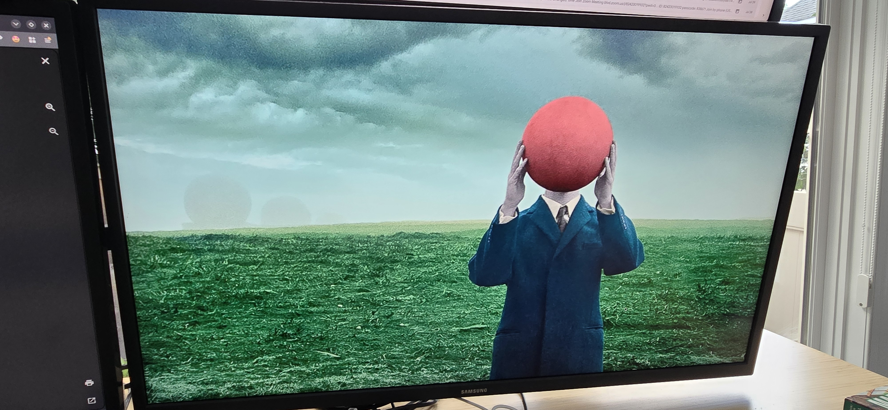
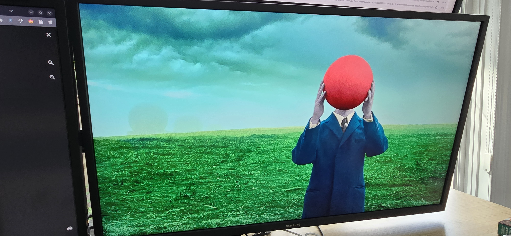

I have always liked running my monitors with more saturation than the default Linux desktop gives me. NVIDIA users have had Digital Vibrance forever, while AMD users on Linux have mostly had to piece together whatever worked for their current stack.

For a long time, my setup was simple enough. I ran X11 and used a small `saturate.sh` wrapper that pushed the saturation level I wanted to both monitors. The starting point came from this [Arch Linux forum thread](https://bbs.archlinux.org/viewtopic.php?id=247131), where another AMD user was trying to solve the same problem NVIDIA users handled with Digital Vibrance.

The answer came through Harry Wentland's `color-demo-app`, which had a small tool called `cmdemo` that could write a color transformation matrix through XRandR. The old upstream repository was hosted on freedesktop cgit, and the [archived page is still available through the Wayback Machine](https://web.archive.org/web/20251218144007/https://cgit.freedesktop.org/~hwentland/color-demo-app/).

## TLDR

On Ubuntu or Debian based systems:

```bash
sudo apt install build-essential pkg-config libdrm-dev libx11-dev libxrandr-dev
```

On Arch based systems:

```bash
sudo pacman -S base-devel pkgconf libdrm libx11 libxrandr
```

Build `color-demo-app` and check your XRandR output names:

```bash
mkdir -p ~/AMD_Saturate
cd ~/AMD_Saturate
git clone git://people.freedesktop.org/~hwentland/color-demo-app
cd color-demo-app
make
xrandr --query
```

Create `~/AMD_Saturate/saturate.sh` with your own output names:

```bash
#!/bin/bash

~/AMD_Saturate/color-demo-app/saturate.pl DP-3 1.9
~/AMD_Saturate/color-demo-app/saturate.pl HDMI-1 1.9
```

Make it executable and run it from an X11 session:

```bash
chmod +x ~/AMD_Saturate/saturate.sh
~/AMD_Saturate/saturate.sh
```

If it does not work, check whether your output exposes `CTM`:

```bash
xrandr --verbose
```

If `CTM` is missing, this workaround will not work.

## What the wrapper did

My local `saturate.sh` was barely anything, as it called `saturate.pl` once for each monitor with the saturation value I wanted.

```bash
#!/bin/bash

~/AMD_Saturate/color-demo-app/saturate.pl DP-3 1.9
~/AMD_Saturate/color-demo-app/saturate.pl HDMI-1 1.9
```

The output names came from my machine, so yours will likely be different. The `1.9` value is the saturation multiplier I use, with `1.0` being neutral. Higher values increase saturation, and lower values reduce it.

`1.9` is strong, but that is the look I wanted. If you are trying this from scratch, I would start lower and work up through a few values.

```bash
./saturate.pl DP-3 1.2
./saturate.pl DP-3 1.4
./saturate.pl DP-3 1.6
```

The X11 setup was pretty straightforward once everything was built, as `saturate.pl` handled the 3x3 matrix and `cmdemo` pushed it into the output's `CTM` property through XRandR.

The matrix deserves its own explanation once we get to the KWin patch. The useful part for the X11 setup is that `saturate.pl` generated the matrix and `cmdemo` applied it.

{/* TODO: Link to the KWin CTM post once published */}

## What it looked like





## Where Wayland changed things

This worked well enough that I stopped thinking about it for a long time. Once I moved my daily session to Plasma Wayland, the old script stopped being useful because it depended on the X11 display path.

Wayland moved output control into the compositor, which meant the same color tweak had to happen through KWin instead of a shell script calling XRandR.
